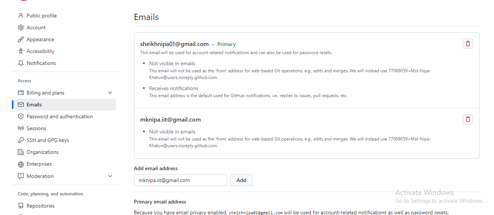

## Local git set up guide with GitHub.




TO set up the GitHub with local git need to hit commad shared below,
1) set up the email address which is use in your GitHub email setting.
```
git config --global user.email "mknipa.iit@gmail.com"
```
2) check now to configuration successgully set or not using hit command below,
```
git config --global user.email
```
<b>Note:</b> the result should be same as the setup email.
